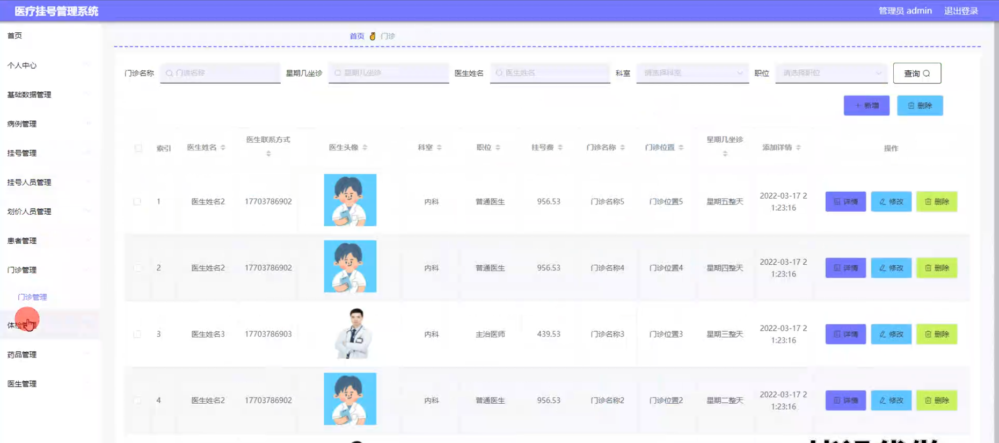

# 基于springboot的医疗挂号管理系统

---
### 👉作者QQ ：1556708905 微信：zheng0123Long (支持定制修改、部署调试、定制毕设)

### 👉接网站建设、小程序、H5、APP、各种系统等

---

#### 介绍

随着医疗信息化的发展，传统的医疗挂号管理方式已经无法满足现代医院高效运作的需求。为了提高医疗服务效率，优化患者就医体验，我们开发了一款基于Spring Boot的医疗挂号管理系统。该系统集成了挂号、病例管理、患者管理、医生管理、药品管理等多个功能模块，旨在为医院提供一个全面、高效、易用的信息化管理平台。
在当前医疗信息化领域，尽管已有多种管理系统，但针对挂号流程及其相关管理的综合系统仍存在不足。特别是在角色权限划分、流程优化、数据整合等方面，现有系统往往无法满足医院的个性化需求。因此，我们的研究旨在填补这一空白，提供一种更加灵活、功能更加全面的医疗挂号管理系统。

#### 技术栈

后端技术栈：Springboot+Mysql+Maven

前端技术栈：Vue+Html+Css+Javascript+ElementUI

开发工具：Idea+Vscode+Navicate

#### 系统功能介绍

该系统主要包含四种角色：管理员、挂号人员、医生和划价人员。不同角色拥有不同的功能模块，以满足各自的工作需求。

管理员角色：  
个人中心：管理员可以管理自己的个人信息，如修改密码、查看操作记录等。  
基础数据管理：维护系统的基础数据，如科室信息、病种分类等。  
病例管理：查看和管理所有患者的病例信息。  
挂号管理：监督和管理挂号流程，包括挂号记录、挂号状态等。  
挂号人员管理：添加、删除、修改挂号人员的信息和权限。  
划价人员管理：添加、删除、修改划价人员的信息和权限。  
患者管理：查看和管理患者的基本信息和就诊记录。  
门诊管理：管理门诊的排班、医生出诊情况等信息。  
体检管理：记录和管理患者的体检信息和结果。  
药品管理：维护药品信息，包括药品名称、价格、库存等。  
医生管理：添加、删除、修改医生的信息和权限。  

挂号人员角色：  
个人中心：管理个人信息。  
病例管理：查看和记录患者的病例信息。  
挂号管理：进行挂号操作，包括选择医生、科室、时间等。  
患者管理：查看和管理患者的基本信息。  
门诊管理：查看门诊的排班情况，以便进行挂号安排。  
药品管理：查看药品信息，以便在挂号时提供必要的药品信息给患者。  

医生角色：  
个人中心：管理个人信息。  
病例管理：查看和记录患者的病例信息。  
挂号管理：查看自己的挂号记录，包括患者的基本信息和挂号时间。  
患者管理：查看和管理自己的患者列表及其就诊记录。  
门诊管理：查看自己的门诊排班情况。  
体检管理：查看患者的体检结果，以便进行诊断和治疗。  
药品管理：查看药品信息，以便在开药时提供准确的信息。  

划价人员角色：  
个人中心：管理个人信息。  
病例管理：查看患者的病例信息，以便进行费用划价。  
挂号管理：查看挂号记录，以便进行费用计算。  
患者管理：查看患者的基本信息，以便进行费用划价。  
门诊管理：查看门诊记录，以便进行费用计算。  
体检管理：查看体检项目，以便进行费用划价。  
药品管理：查看药品价格，以便进行药品费用的计算。  
医生管理：查看医生信息，以便在费用划价时考虑医生的级别和费用标准。  

#### 系统作用

该医疗挂号管理系统的实施，将显著提高医院的管理效率和服务质量。具体来说，其作用主要体现在以下几个方面：

优化挂号流程：通过系统化的挂号管理，减少患者等待时间，提高挂号效率。  
提升数据管理质量：集中管理患者、医生、药品等基础数据，提高数据准确性和一致性。  
增强信息共享：不同角色之间可以实时共享患者信息和病例资料，提升协作效率。  
提高决策支持：系统提供丰富的数据报表和统计功能，为医院管理层提供决策支持。  
改善用户体验：提供便捷的患者管理功能，提升患者就医体验。  

#### 系统功能截图

代码结构

数据库表

登录

管理员端基础数据管理

病例管理

挂号管理

挂号人员管理

划价人员管理

患者管理

门诊管理

体验管理

药品管理

医生管理

挂号人员端病例管理

医生端个人信息

划价人员端药品信息

#### 总结

在当前医疗信息化快速发展的背景下，我们的医疗挂号管理系统为医院提供了一个全面、高效的信息化管理平台。通过细致的角色划分和丰富的功能模块，该系统能够显著提升医院的管理效率和服务质量。同时，我们也意识到，在实际应用中，系统仍需不断迭代和优化，以适应不同医院的个性化需求和医疗政策的变化。未来，我们将继续致力于医疗信息化领域的研究和探索，为医疗行业的进步贡献更多的力量。

#### 使用说明

创建数据库，执行数据库脚本 修改jdbc数据库连接参数 下载安装maven依赖jar 启动idea中的springboot项目

后台登录页面
http://localhost:8080/yiliaoguahao/admin/dist/index.html

管理员				账户:admin 		密码：admin

挂号人员				账户:a1 		密码：123456

划价人员				账户:a1 		密码：123456

医生				账户:a1 		密码：123456